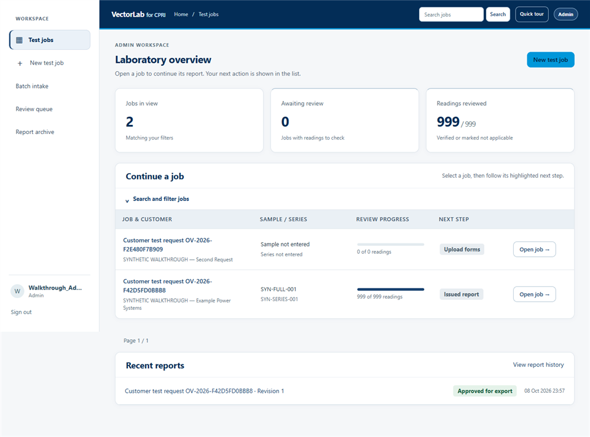
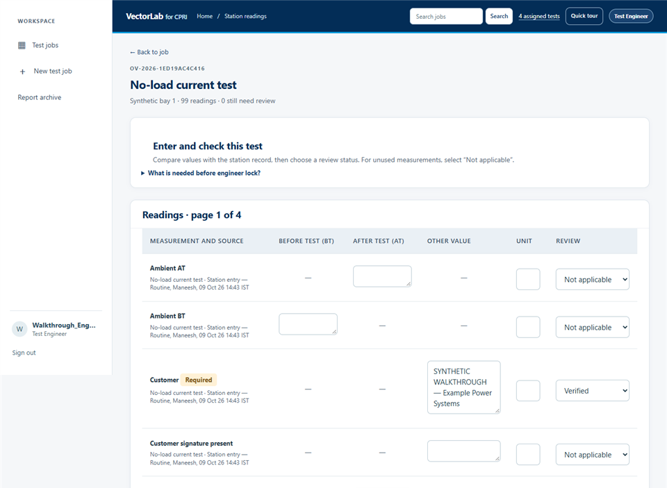
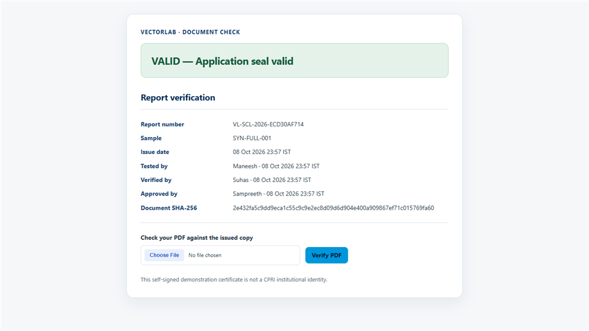

# VectorLab for CPRI Track 3

**From customer request and station readings to a traceable, reviewed transformer test certificate.**

[](https://github.com/minkysponge-wq/Powernext-ai-/actions/workflows/ci.yml)

| Verified Django tests | Synthetic UI run | Fixed report |
|---|---|---|
| 252 passing | 37 s end to end on the release run; 7 s HoD approval to issue | 18 pages |

The previous UI run completed in 31 seconds; demo timing varies by machine and load.

| Job dashboard | Station entry | Public PDF verification |
|---|---|---|
|  |  |  |

**Quick start:** Install Python 3.12 and Node.js, then follow [Local setup](#local-setup). The synthetic seed and demo signer keep private customer records and paid AI out of a fresh clone.

**Read next:** [Architecture](docs/ARCHITECTURE.md) · [Security](docs/SECURITY.md) · [Report template](docs/REPORT_TEMPLATE.md) · [Rules](docs/RULES.md) · [Second-form stress check](docs/UNSEEN_FORM_STRESS.md) · [Demo script](docs/DEMO_SCRIPT.md) · [Changelog](CHANGELOG.md)

VectorLab carries a transformer test job from customer request through station readings, engineering review, Quality verification, HoD approval, and a controlled PDF certificate. Each reading retains its source and review state. The fixed `CPRI-SCL-TR-v1` report computes deterministic results from reviewed inputs and keeps drafts separate from issued certificates.


## Stack and prerequisites

Python 3.12, Django 5.2, Django Q2, PostgreSQL 17 for deployment (SQLite locally), ReportLab/pypdf/pyHanko for reports and signatures, Caddy/WhiteNoise for serving, Playwright with local Chrome for browser acceptance, and optional Gemini or local extraction. Install Node.js and Docker Compose for the browser-test and deployment paths. The pinned Python dependencies are in `requirements.txt` and `app/requirements.txt`; Playwright is pinned in `package.json`.

## Local setup

From the repository root on Windows PowerShell:

```powershell
py -3.12 -m venv .venv
.\.venv\Scripts\python.exe -m pip install -r requirements.txt
npm ci
Copy-Item .env.example app/.env
# For local-only development, set DJANGO_DEBUG=1 and
# DJANGO_ALLOWED_HOSTS=127.0.0.1,localhost,testserver in app/.env.
.\.venv\Scripts\python.exe app/manage.py migrate
.\.venv\Scripts\python.exe app/manage.py seed_cpri_fixed_template
.\.venv\Scripts\python.exe app/manage.py seed_verdict_candidates
.\.venv\Scripts\python.exe app/manage.py create_demo_signer
.\.venv\Scripts\python.exe app/manage.py seed_walkthrough_demo
.\.venv\Scripts\python.exe app/manage.py runserver
```

Run the task worker in another terminal:

```powershell
.\.venv\Scripts\python.exe app/manage.py qcluster
```

For the local walkthrough, set `DJANGO_DEBUG=1`, `VECTORLAB_FORCE_MFA=1`, and `VECTORLAB_PUBLIC_BASE_URL=http://127.0.0.1:8000` in `app/.env`. The signer command creates an untrusted, self-signed DEMO key in ignored `private/` and prints the two `PDF_SIGNING_*` settings to add to `app/.env`; issuance refuses to proceed without them. The walkthrough seed invokes `create_demo_users` once, prints the temporary password and authenticator enrollment URIs, then creates one synthetic job with station data. It does not approve or issue anything. Give each role owner only their enrollment URI. The ignored `output/demo-users.json` is local access material; delete it after the walkthrough. The separate source-backed HVD review needs a private, explicitly authorised data bundle and is not part of a fresh clone.

`python demo/seed_station_entry.py` performs a read-only preflight; add `--apply` to replay the synthetic customer and station workflow through the app's HTTP screens. The former source-backed replay is retained only in ignored private storage.

## Docker Compose

Fill `app/.env` from the example with independent production secrets and deployment URLs, then run `docker compose -f app/compose.yaml --project-directory app up --build`. The Compose stack starts PostgreSQL, migrations, web, worker and Caddy. `deploy/` documents deployment files and the private-storage boundary.

## Test and workflow

Run `.\.venv\Scripts\python.exe app/manage.py test lab --noinput` with `VECTORLAB_FORCE_MFA=0` for the test process, then restore MFA for the demo. Run `.\.venv\Scripts\python.exe app/manage.py check --deploy` with production environment values. For the signed acceptance benchmark, run `.\.venv\Scripts\python.exe benchmark/run_signed_acceptance.py`. Verify local audit chains with `.\.venv\Scripts\python.exe app/manage.py verify_audit_chain`.

With the local server running after the walkthrough seed, run `node demo/full_ui_run.cjs` once to replay the synthetic job through the customer, station, Engineer, Quality, HoD and verification screens. It saves ordered screenshots, the signed 18-page PDF, the customer-downloaded copy, the tamper result and stage timings in ignored `demo/run/`. The two PDF copies must have identical bytes. Without SMTP credentials, delivery is explicitly an **unsent outbox draft**, not a sent email. The run uses fictional, perturbed readings and candidate rule set v2. Only this exact local synthetic fixture can pass the demo issue gate while v2 remains pending CPRI adoption; every report page says **SYNTHETIC DEMO — not a CPRI certificate**. The normal rule-confirmation gate remains in force for real jobs.

1. **Customer:** submit a request and watch timestamped status changes.
2. **Admin:** register the sample, confirm scope and assign stations.
3. **Station Engineer:** enter readings in digital logsheets and attach source evidence.
4. **Engineer:** reconcile source readings, apply versioned rules and lock the draft.
5. **Quality:** verify evidence and return or approve the technical review.
6. **HoD:** authenticate with MFA, approve and sign the issued PDF; delivery and public verification follow.

See [demo script](docs/DEMO_SCRIPT.md) for a judge walkthrough and [architecture](docs/ARCHITECTURE.md) for the data flow.

## Problem statement coverage

| Need | VectorLab feature |
|---|---|
| Reduce manual report assembly | Fixed template, mapped readings, calculated tables, curves and PDF generation |
| Preserve measurement traceability | Source-page binding, human review state, versioned rules and append-only audit chain |
| Coordinate multiple roles | Customer, Admin, station, Engineer, Quality and HoD workflow with separation of duties |
| Control the legal certificate | Draft watermark, approval gate, report number, signature, PDF hash and verification page |
| Use AI safely | Gemini/local extraction assists transcription; critical readings still require human confirmation |

## Known limits

The demo signer is self-signed and does not establish institutional trust. Several IS clause numbers remain `[CLAUSE TBC]`, and rule set v2 awaits CPRI adoption. Real source scans, the HVD job database and its draft are private and excluded from submission. The local application is not a production validation claim. See [rules](docs/RULES.md), [report template](docs/REPORT_TEMPLATE.md), [security](docs/SECURITY.md) and [cleanup report](CLEANUP_REPORT.md).
