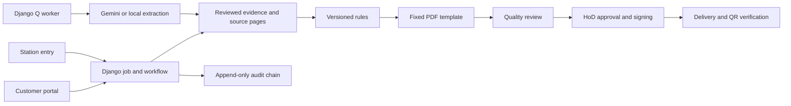

# Architecture

The Django app owns the customer request, job, source documents, readings, rule versions and reports. The station screens save individual readings with source and reviewer state. Engineering rules evaluate reviewed readings only. Quality and HoD are separate approval stages. The issued PDF is signed, hashed and exposed through a verification endpoint. A Django Q worker handles background extraction and delivery; optional Gemini or local extraction is a transcription aid.

## Data flow

1. The customer request creates a job and file number. Admin assigns stations and the request supplies cover metadata.
2. Station engineers enter measurements, or source PDFs and CSV files are imported. Each reading stores its unit, source reference, entry method and review state.
3. An engineer confirms critical readings and locks the job. The report snapshot freezes the selected mapping and rule versions.
4. Configured rules produce deterministic verdicts and margins. The fixed renderer assembles the draft from mapped fields only.
5. Quality verifies the frozen revision; a separate HoD approves it with MFA. Issuance allocates the report number, signs the PDF and stores its hash.
6. Delivery records the customer notification. The portal offers the issued copy; the QR page compares uploaded PDF bytes with the stored hash.

The database and uploaded media remain private. Background extraction and delivery run through Django Q; the browser displays persisted results, never a second calculation path.

Runtime code remains under `app/` so Django imports, URLs, tables and migration names stay stable. The deployable Compose file remains at `app/compose.yaml`; `deploy/` holds operator guidance.
