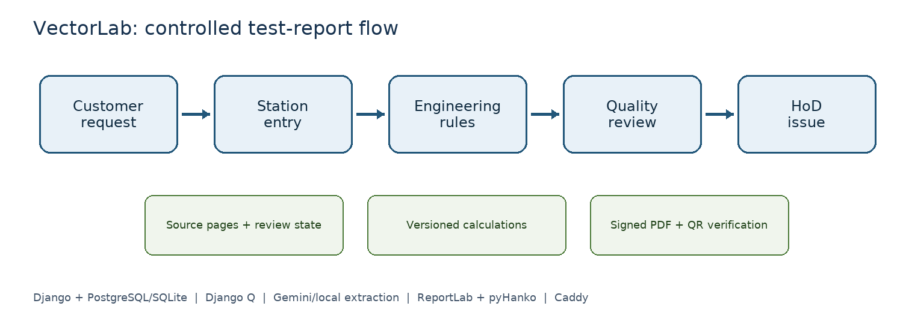
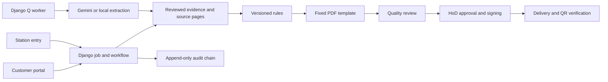

# Architecture

The Django app owns the customer request, job, source documents, readings, rule versions and reports. The station screens save individual readings with source and reviewer state. Engineering rules evaluate reviewed readings only. Quality and HoD are separate approval stages. The issued PDF is signed, hashed and exposed through a verification endpoint. A Django Q worker handles background extraction and delivery; optional Gemini or local extraction is a transcription aid.

Runtime code remains under `app/` so Django imports, URLs, tables and migration names stay stable. The deployable Compose file remains at `app/compose.yaml`; `deploy/` holds operator guidance.
